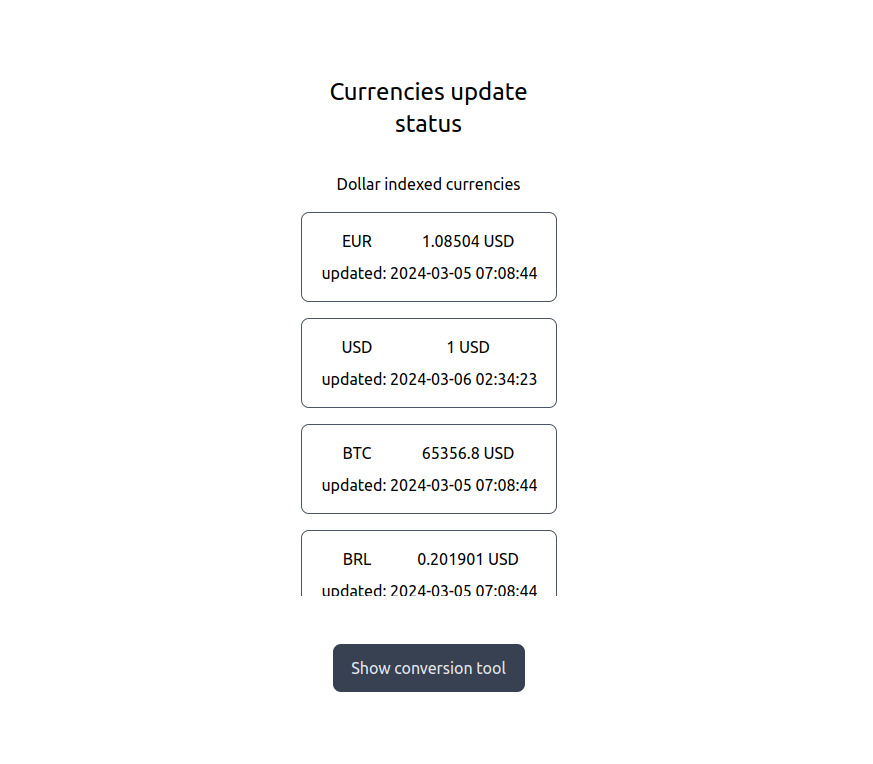

# Currency Conversion Project
## Problem requirements
This is a test project for a junior developer position the requirements can be simplified as follows:  
- Solution must run on an ubuntu environment, preferably using docker.
- It should run with at most the command for installing the dependencies plus the application start command.
- It may or may not be backed by frameworks.
- It must convert currencies by following the pattern `?from=BTC&to=EUR&amount=123.45`.
- Dollar must be the index currency.
- It must at least convert between USD, BRL, EUR, BTC and ETH.  

## Running the solution
With docker-compose set up and ports 8000 and 5432 available, clone this repository and run  
`docker-compose up --build` to spin up the database and the application server

## User interface
### 1. Conversion tool

Path: `/`  
User select the currencies to perform the calculation on the dropdown elements, set a positive value to amount and click `convert`.  
Conversion freezes the formulary so the user must click clear to be able to calculate again.

### 2. Currency update status

Path: `/currencies`  
User can see a list of the supported currencies and the last update timestamp

### 3. Update currency

Path: `/update`  
This UI should be protected under authentication  
Allows admin to fix or change any value for currency that was not correctly retrieved by the periodic backing system. 

## API

Path: `/api/docs`  
Fastapi provides an ui with interactive documentation.